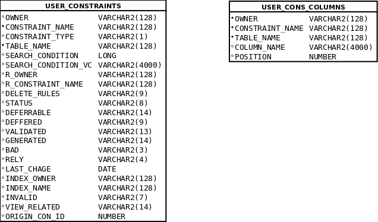

# Tutorium - Grundlagen Datenbanken - Blatt 6

## Vorbereitungen
* Für dieses Aufgabenblatt wird die SQL-Dump-Datei `01_tutorium.sql` benötigt, die sich im Verzeichnis `sql` befindet.
* Die SQL-Dump-Datei wird in SQL-Plus mittels `start <Dateipfad/zur/sql-dump-datei.sql>` in die Datenbank importiert.
* Beispiele
  * Linux `start ~/Tutorium.sql`
  * Windows `start C:\Users\max.mustermann\Desktop\Tutorium.sql`

## Datenbankmodell


## Data-Dictionary-Views


## Aufgaben

### Aufgabe 1
Wie heißt der Primary Key Contraint der Tabelle `VEHICLE` und für welche Spalten wurde er angelegt?

#### Lösung
```sql
-- Fabian
select constraint_name,constraint_type, search_condition, r_owner, r_constraint_name
from user_constraints
where table_name = 'VEHICLE' AND Constraint_type = 'P';

-- Markus
P = Primary Key
R = Foreign Key
U = Unique
C = Check

SELECT ucc.constraint_name, ucc.column_name, ucc.position
FROM user_cons_columns ucc
WHERE ucc.constraint_name IN (
  SELECT uc.constraint_name
  FROM user_constraints uc
  WHERE uc.table_name LIKE 'VEHICLE'
  AND uc.constraint_type = 'P'
);

-- Alternative Lösung
SELECT ucc.constraint_name, ucc.column_name, ucc.position
FROM user_cons_columns ucc
  INNER JOIN user_constraints uc ON (ucc.constraint_name = uc.constraint_name)
WHERE uc.table_name LIKE 'VEHICLE'
AND uc.constraint_type = 'P';
```

### Aufgabe 2
Für welche Spalte**n** der Tabelle `ACC_VEHIC` wurde ein Foreign Key angelegt und auf welche Spalte/n in welcher Tabelle wird er referenziert?

#### Lösung
```sql
-- Für SQL-Plus
COLUMN CONSTRAINT_NAME FORMAT a25
COLUMN COLUMN_NAME FORMAT a15
COLUMN TABLE_NAME FORMAT a15

SELECT ucc.constraint_name, ucc.column_name, ucc.table_name
FROM user_cons_columns ucc
WHERE ucc.constraint_name IN (
  SELECT uc.r_constraint_name
  FROM user_constraints uc
  WHERE uc.table_name LIKE 'ACC_VEHIC'
  AND uc.constraint_type = 'R'
);
```

### Aufgabe 3
Erstelle einen Check Constraint für die Tabelle `ACCOUNT`, dass der Wert der Spalte `U_DATE` nicht älter sein kann als `C_DATE`.

#### Lösung
```sql
-- Constraint
ALTER TABLE ACCOUNT ADD CONSTRAINT c_date
CHECK (U_DATE >= C_DATE);

-- Überprüfung
UPDATE account
SET u_date = TO_DATE('2014-11-13', 'YYYY-MM-DD')
WHERE account_id = 1;
```

### Aufgabe 4
Erstelle einen Check Constraint der überprüft, ob der erste Buchstabe der Spalte `GAS_NAME` der Tabelle `GAS` groß geschrieben ist.

#### Lösung
```sql
-- Fabian
ALTER TABLE gas
ADD CONSTRAINT u_gas_name
CHECK (gas_name = INITCAP(gas_name));

-- Markus
ALTER TABLE gas
ADD CONSTRAINT u_gas_name
CHECK (REGEXP_LIKE(gas_name, '^[A-Z].*$', 'c'));
```

### Aufgabe 5
Erstelle einen Check Contraint der überprüft, ob der Wert der Spalte `IDENTICATOR` der Tabelle `ACC_VEHIC` eins von diesen möglichen Fahrzeugkennzeichenmustern entspricht. Nutze Reguläre Ausdrücke.

+ B:AB:5000
+ TR:MP:1
+ Y:123456
+ THW:98765
+ MZG:XZ:96

#### Lösung
```sql
-- Constraint
alter table acc_vehic
add constraint c_kennzeichen_etspricht
check (regexp_like(identicator, '^[A-Z]{1,3}:([A-Z]{1,2}:[1-9][0-9]{0,3}|[1-9][0-9]{0,5})$', 'c'));

-- Tests durch Falscheingabe
UPDATE acc_vehic
SET identicator = '8:ß:I'
WHERE vehicle_id = 1;

UPDATE acc_vehic
SET identicator = 'ZF:53:833'
WHERE vehicle_id = 1;

UPDATE acc_vehic
SET identicator = '10:MP:783'
WHERE vehicle_id = 1;

UPDATE acc_vehic
SET identicator = '10: :783'
WHERE vehicle_id = 1;

-- Update funktioniert
UPDATE acc_vehic
SET identicator = 'TR:WS:52'
WHERE vehicle_id = 1;
```

### Aufgabe 6 - Wiederholung
Liste für alle Personen den Verbrauch an Kraftstoff auf (Missachte hier die unterschiedlichen Kraftstoffe). Dabei ist interessant, wie viel Liter die einzelne Person getankt hat und wie viel Euro sie für Kraftstoffe ausgegeben hat.

#### Lösung
```sql
-- Fabian
SELECT r.LITER,Surname, Forename, r.Price_L, r.kilometer, SUM(r.Price_l*r.Kilometer) Summe
FROM RECEIPT r
  INNER JOIN ACCOUNT ON (Account.account_id = r.account_id)
GROUP BY r.account_id

-- Markus
COLUMN SURNAME FORMAT a15
COLUMN FORNAME FORMAT a15

SELECT  a.surname,
        a.forename,
        (
          SELECT SUM(r.price_l*r.liter*1+r.duty_amount)
          FROM receipt r
          WHERE account_id = a.account_id
          GROUP BY r.account_id
        ) "Ausgaben2",
        (
          SELECT SUM(r.liter)
          FROM receipt r
          WHERE account_id = a.account_id
        ) "Getankte Liter"
FROM account a;
```

### Aufgabe 7 - Wiederholung
Liste die Tankstellen absteigend sortiert nach der Kundenanzahl über alle Jahre.

#### Lösung
```sql
-- Fabian
select gas_station_id
from gas_station
order by gas_station_id desc;

-- Markus
SELECT  TO_CHAR(r.c_date, 'YYYY') "Jahr",
        p.provider_name "Provider",
        gs.street "Straße",
        a.plz "PLZ",
        a.city "Stadt",
        COUNT(r.account_id) "Anzahl"
FROM  gas_station gs
  INNER JOIN provider p ON (p.provider_id = gs.provider_id)
  INNER JOIN address a ON (a.address_id = gs.address_id)
  INNER JOIN receipt r ON (r.gas_station_id = gs.gas_station_id)
GROUP BY r.c_date, p.provider_name, gs.street, a.plz, a.city;
```

### Aufgabe 8 - Wiederholung
Erweitere das Datenbankmodell um ein Fahrtenbuch, sowie es Unternehmen für ihren Fuhrpark führen. Dabei ist relevant, welche Person an welchem Tag
ab wie viel Uhr ein Fahrzeug für die Reise belegt,
wie viele Kilometer zurück gelegt wurden und wann die Person das Fahrzeug wieder abgibt.

Berücksichtige bitte jegliche Constraints!

#### Lösung
```sql
-- Fabian
CREATE TABLE Fahrtenbuch
(Account_name NUMBER(38) NOT NULL,
BEGINN_UHRZEIT time('HH:MM:SS') NOT NULL,
BEGINN_DATE date('YYYY-MM-DD') NOT NULL,
ENDE_UHRZEIT time('HH:MM:SS') NOT NULL,
END_DATE date('YYYY-MM-DD') NOT NULL,
FOREIGN KEY(Account_name) REFERENCES ACCOUNT(ACCOUNT_ID));

INSERT INTO Fahrtenbuch (Account_name ,BEGINN_UHRZEIT, BEGINN_DATE,ENDE_UHRZEIT,END_DATE)
VALUES ();

-- Markus
CREATE TABLE LBOOK (
  LBOOK_ID      NUMBER(38) NOT NULL,  -- PK
  ACCOUNT_ID    NUMBER(38) NOT NULL,  -- FK
  ACC_VEHIC_ID  NUMBER(38) NOT NULL,  -- FK
  B_DATE        DATE NOT NULL,
  KILOMETER     NUMBER(7,3) NOT NULL,
  S_DATE        DATE NOT NULL
);

ALTER TABLE LBOOK
ADD CONSTRAINT LBOOK_PK
PRIMARY KEY (LBOOK_ID);

ALTER TABLE LBOOK
ADD CONSTRAINT buxdehude_fk
FOREIGN KEY (ACCOUNT_ID) REFERENCES ACCOUNT(ACCOUNT_ID);

ALTER TABLE LBOOK
ADD CONSTRAINT trier_fk
FOREIGN KEY (ACC_VEHIC_ID) REFERENCES ACC_VEHIC(ACC_VEHIC_ID);

ALTER TABLE LBOOK
ADD CONSTRAINT check_date
CHECK (S_DATE >= B_DATE);
```


